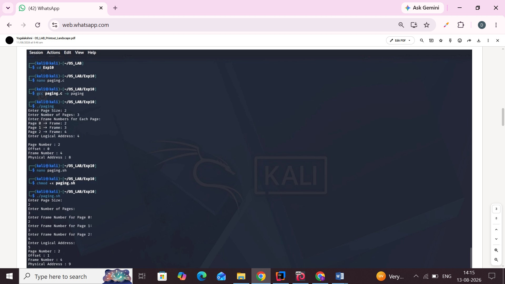

# Experiment 10 – Paging Technique

## Aim

To study and implement the paging technique in memory management.

## C Program

[View C Program](10cprogram.c)

### C Program Output

## Shell Program

[View Shell Program](shellprogram.sh)

### Shell Program Output

## Result

Thus, the paging technique was implemented and executed successfully, and the outputs were verified.
