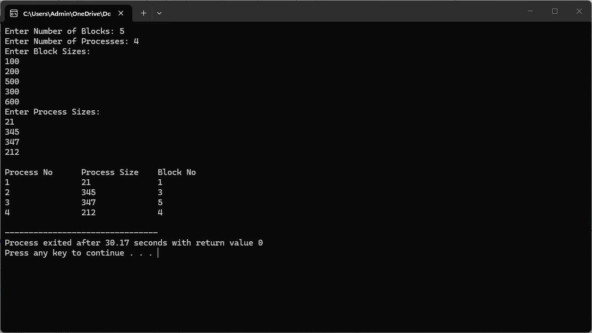
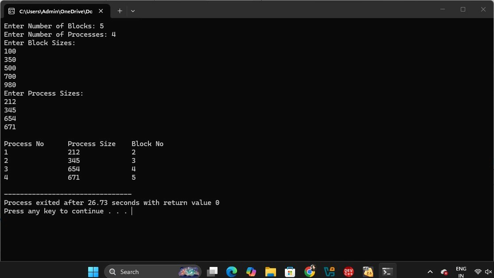
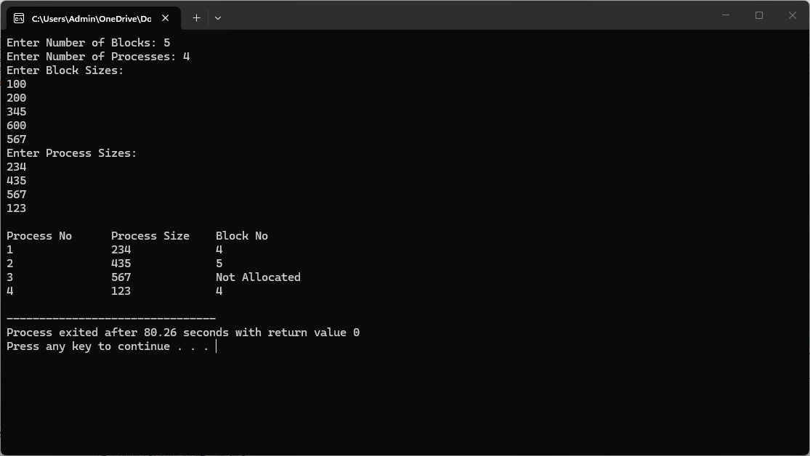

# Experiment 11 – Memory Allocation Methods

## Aim

To implement and study different memory allocation methods.

## Program 1

[View Program 1](11a.c)

### Output

---

## Program 2

[View Program 2](11b.c)

### Output

### Shell Output

---

## Program 3

[View Program 3](11c.c)

### Output

### Shell Output

## Result

Thus, the memory allocation programs were executed successfully and the outputs were verified.
