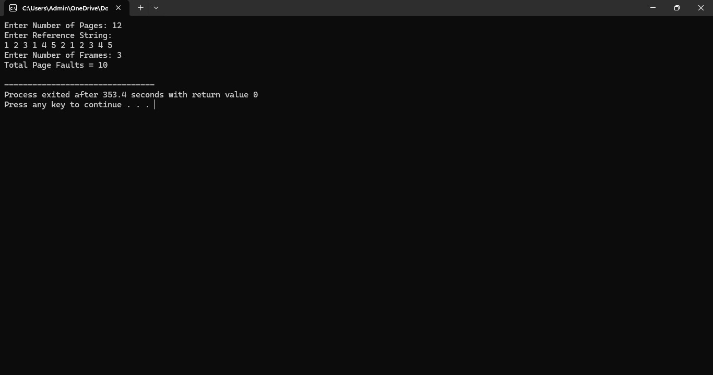
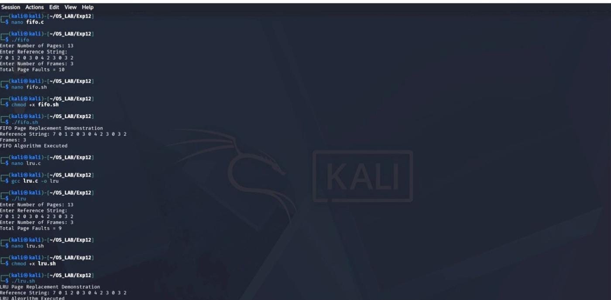

# Experiment 12 – Page Replacement Algorithms

## Aim

To implement and study page replacement algorithms and observe their execution and output.

## Program 1

[View Program 1](12_cprogram.c)

### Output

### Shell Output

---

## Program 2

[View Program 2](12bcprogram.c)

### Output

### Shell Output

---

## Program 3

[View Program 3](12cprogram.c)

### Shell Output

---

## Shell Program

[View Shell Program](12shell.sh)

---

## Result

Thus, the page replacement programs were executed successfully and the outputs were verified.
