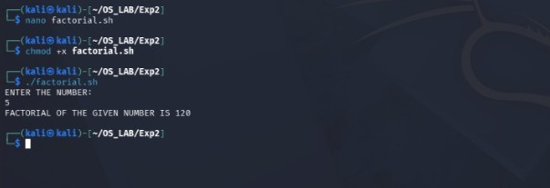
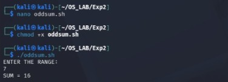
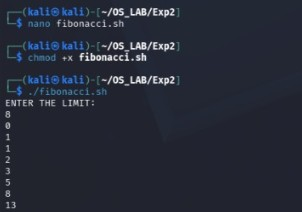
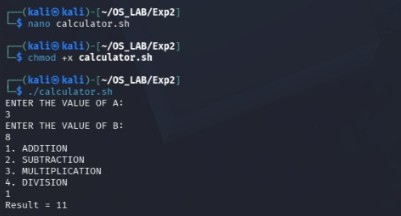
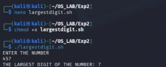
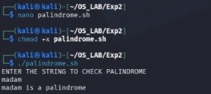
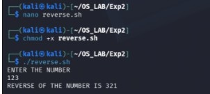

# Experiment 2 – UNIX Commands and Shell Programming

## Aim

To study basic UNIX commands and shell programming.

## Program

[View Shell Program](exp2shell.sh)

## Output

### Output 1

### Output 2

### Output 3

### Output 4

### Output 5

### Output 6

### Output 7

### Output 8

## Result

Thus, the basic UNIX commands and shell programs were executed successfully and the outputs were verified.
