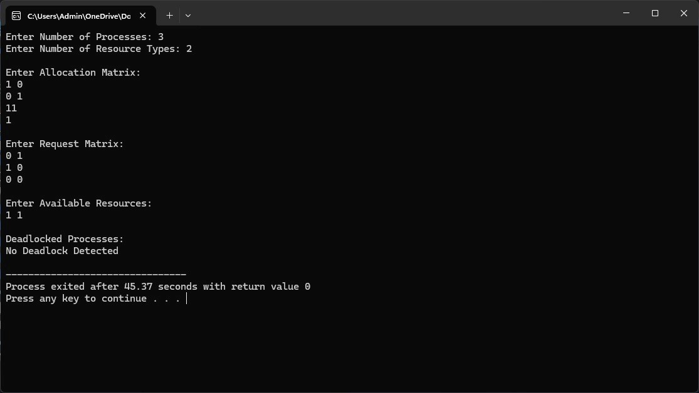

# Experiment 8 – Deadlock Detection Algorithm

## Aim

To implement and study the Deadlock Detection Algorithm and identify whether the system is in a deadlock state.

## C Program

[View C Program](8cprogram.c)

### C Program Output

## Shell Program

[View Shell Program](8shell.sh)

### Shell Program Output

## Result

Thus, the Deadlock Detection Algorithm was implemented and executed successfully, and the output was verified.
