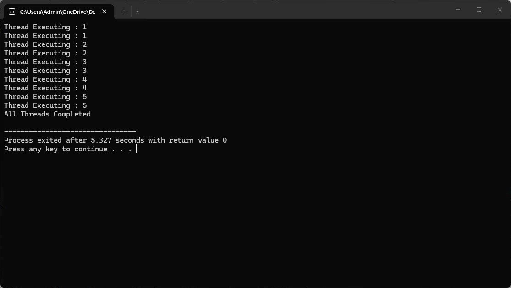
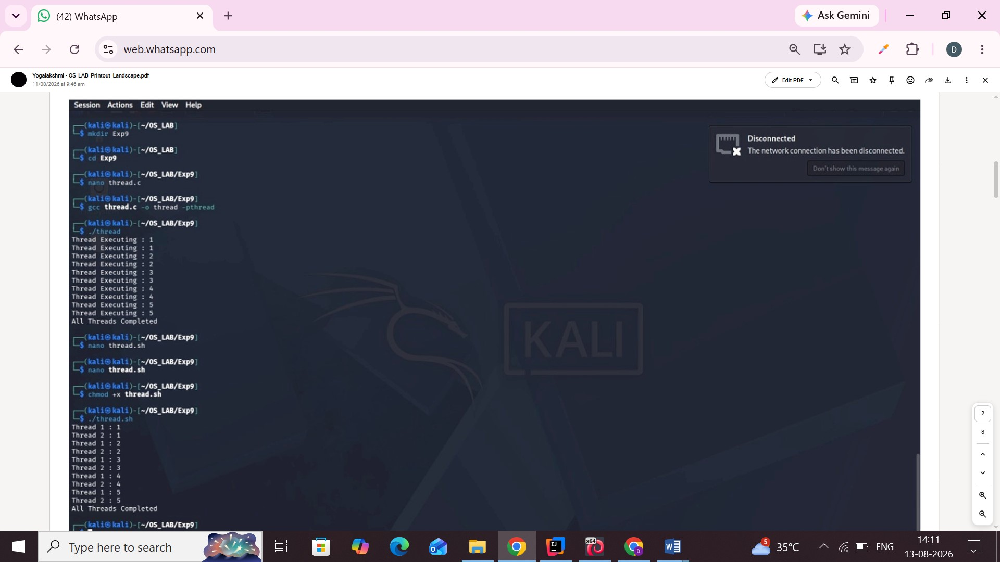

# Experiment 9 – Threading

## Aim

To study and implement threading using C and shell programming.

## C Program

[View C Program](9cprogram.c)

### C Program Output

## Shell Program

[View Shell Program](9shellprogram.sh)

### Shell Program Output

## Result

Thus, the threading programs were executed successfully and the outputs were verified.
