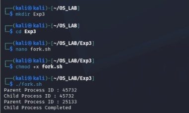
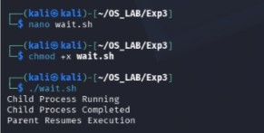
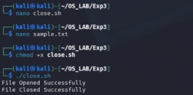

# Experiment 3 – System Calls: Fork, Exit, Getpid, Wait, Close

## Aim

To study and implement system calls such as fork, exit, getpid, wait and close in UNIX/Linux.

## Programs

- [View Program 1 - Fork](3ac.c)
- [View Program 2 - Wait](3bc.c)
- [View Program 3 - Close](3c.c)
- [View Shell Program](3shell.sh)

## Output

### Output 1

### Output 2

### Output 3

## Result

Thus, the system calls were studied and executed successfully, and the outputs were verified.
