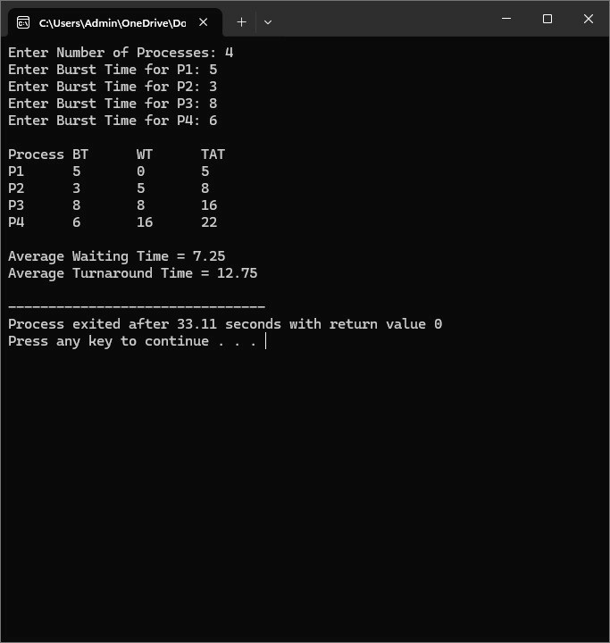
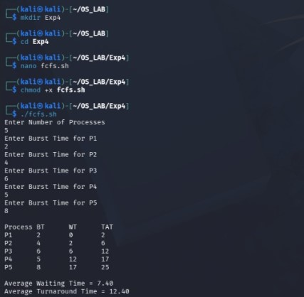
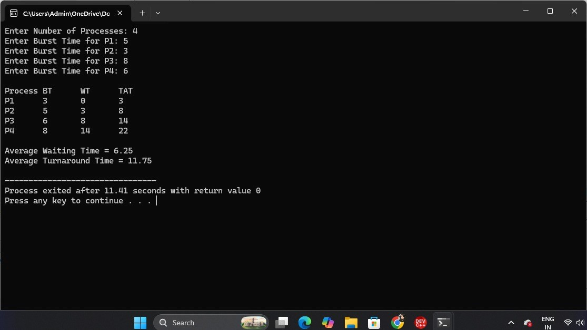
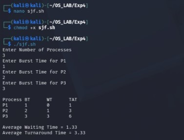
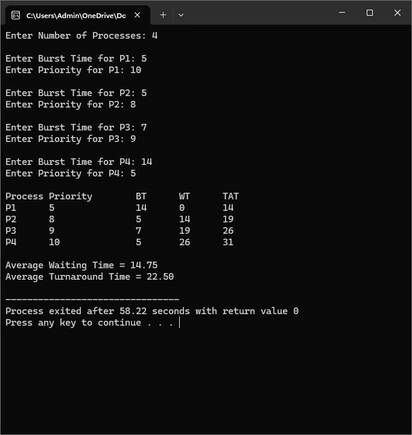
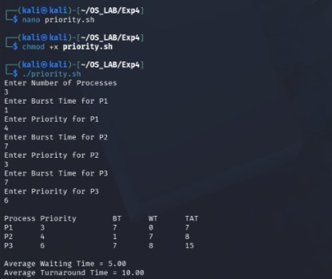
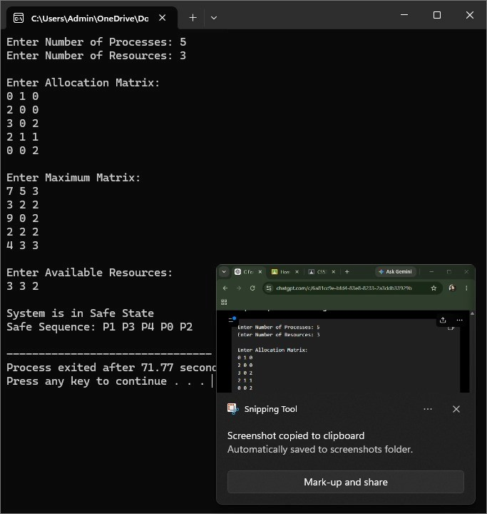
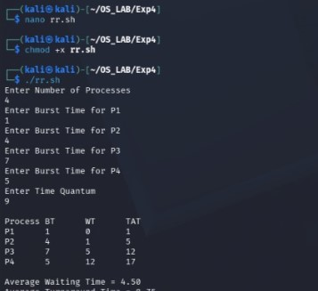

# Experiment 4 – CPU Scheduling Algorithms

## Aim

To implement CPU scheduling algorithms and study their execution and output.

## Program 1

[View Program 1 – fcfs.c](fcfs.c)

### Output 1

### Shell Output

---

## Program 2

[View Program 2 – 4b.c](4b.c)

### Output 2

### Shell Output

---

## Program 3

[View Program 3 – 4c.c](4c.c)

### Output 3

### Additional Output

---

## Program 4

[View Program 4 – 4d.c](4d.c)

### Output 4

### Shell Output

---

## Shell Program

[View Shell Program](shell4.sh)

## Result

Thus, the CPU scheduling programs were executed successfully and the outputs were verified.
