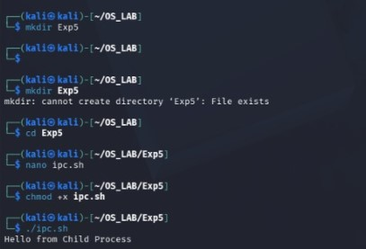

# Experiment 5 – Inter Process Communication (IPC)

## Aim

To study and implement Inter Process Communication (IPC) and observe its execution and output.

## C Program

[View C Program](5program.c)

### C Program Output

## Shell Program

[View Shell Program](5shell.sh)

## Result

Thus, the Inter Process Communication program was executed successfully and the output was verified.
