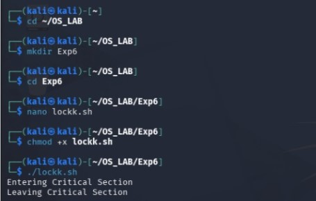

# Experiment 6 – Semaphore Implementation

## Aim

To implement and study semaphore operations for process synchronization.

## Program

[View C Program](6cprogram.c)

### Output

## Shell Program

[View Shell Program](6shell.sh)

## Result

Thus, the semaphore implementation program was executed successfully and the output was verified.
